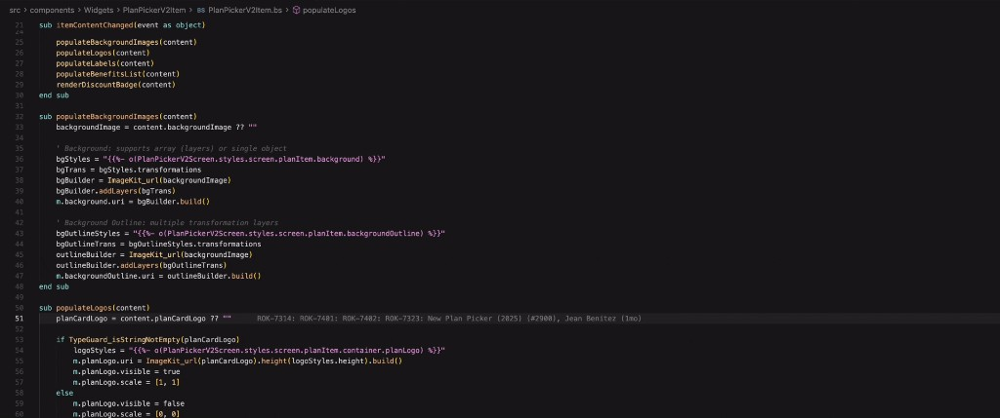
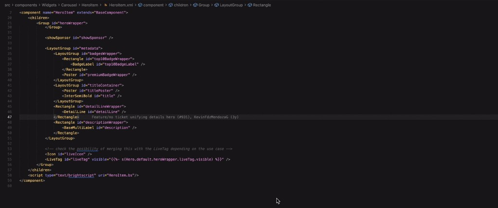
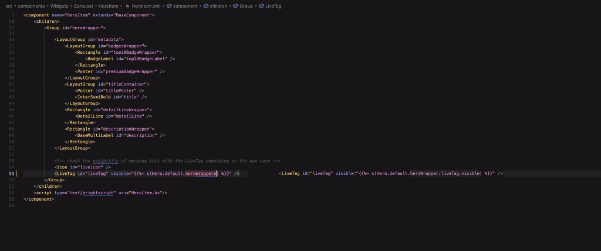

# EJS Navigator for Roku

A powerful VSCode extension that provides intelligent navigation, hover previews, and autocomplete for EJS template variables in Roku BrightScript code. Navigate seamlessly between your code and JSON configuration files.





## Features

### 🎯 Go to Definition
Ctrl+Click (Cmd+Click on Mac) on any part of an EJS path to jump directly to its definition in JSON files. Works with deeply nested paths and automatically finds the correct location even when property names appear multiple times in your JSON.

**Example:**
```xml
<LiveTag visible="{}" />
```
Click on any part of the path:
- `Hero` → jumps to Hero object
- `heroWrapper` → jumps to Hero.default.heroWrapper
- `visible` → jumps to the exact visible property


### 🔍 Smart Hover Preview
Hover over any segment of an EJS path to see the object or value at that level. No need to open JSON files to check structure or values.

**What you see:**
- **Objects** - Full JSON structure with property count
- **Arrays** - Array contents with item count
- **Primitives** - Actual values with type information
- **Nested paths** - Preview the exact level you're hovering over

**Example:**
```brightscript
"{}"
```
- Hover on `heroWrapper` → Shows the entire heroWrapper object
- Hover on `liveTag` → Shows the liveTag object
- Hover on `visible` → Shows the boolean value


### ⚡ Intelligent Autocomplete
Get real-time suggestions as you type EJS expressions. The extension provides context-aware completions based on your JSON structure.

**Triggers:**
- Type `"{{%- s(` → Shows top-level properties
- Type `.` after a property → Shows child properties
- Press `Ctrl+Space` → Manually trigger suggestions

**What you get:**
- Property names from indexed JSON files
- Type information (Object, Array, string, number, boolean)
- Value previews for primitives
- JSON structure preview for complex objects

**Example workflow:**
```brightscript
"{{%- s(Hero.     ← Type here, see: default, styles, etc.
"{{%- s(Hero.default.     ← Type here, see: heroWrapper, background, etc.
"{{%- s(Hero.default.heroWrapper.     ← Type here, see: liveTag, height, width, etc.
```


### 📁 Flexible File Configuration
Configure which JSON files to index using specific paths or glob patterns. Supports any number of JSON files across your project.

**Default files:**
- `product/descarga.json`
- `data/constants.json`

**Customizable via settings** - See Configuration section below.

## Supported Patterns

The extension recognizes the following EJS template patterns in BrightScript (.bs, .brs) and XML (.xml) files:

### Function Call Patterns
```brightscript
' s() function - string output
"{}"
"{}"

' o() function - output
"{}"

' Direct value output
"{}"
```

### Supported Syntax Variations
```brightscript
' With or without dash
"{}"
"{}"

' With spaces
"{}"

' Constants and prefixes
"{}"
"{}"
```

### Works In All File Types
```xml
<!-- XML files -->
<Component>
  <Label text="{}" />
  <Rectangle color="{}" />
</Component>
```

```brightscript
' BrightScript files (.bs, .brs)
m.label.text = "{}"
color = "{}"
```

## How It Works

1. **Indexing** - On startup, the extension scans configured JSON files and builds an index of all property paths
2. **Real-time Detection** - As you type or hover, it detects EJS patterns in your code
3. **Path Resolution** - Matches the EJS path to indexed JSON locations
4. **Smart Navigation** - Handles nested paths correctly, even with duplicate property names
5. **Auto-refresh** - Re-indexes when JSON files change or settings are updated

## Usage

### Quick Start
1. Install the extension in VSCode or Cursor
2. Open your Roku BrightScript project
3. The extension automatically indexes configured JSON files on startup

### Navigate to Definitions
1. Place your cursor on any EJS variable in your code
2. **Ctrl+Click** (Windows/Linux) or **Cmd+Click** (Mac) to jump to the JSON definition
3. Works on any part of a dotted path - click on the specific segment you want to see

### View Hover Information
1. Hover your mouse over any part of an EJS path
2. A tooltip appears showing:
   - The object/value at that path level
   - Type information
   - Value preview (for objects, formatted JSON)

### Use Autocomplete
1. Start typing an EJS expression: `"{{%- s(`
2. Suggestions appear automatically
3. Type `.` after a property name to see its children
4. Press **Ctrl+Space** to manually trigger suggestions
5. Select a suggestion or keep typing to filter

## Tips & Best Practices

### Navigating Complex Paths
For deeply nested paths like `Hero.default.heroWrapper.liveTag.visible`:
- Click on `heroWrapper` to see its definition and structure
- Hover to quickly preview without navigating
- Use autocomplete to avoid typos in long paths

### Working with Multiple JSON Files
Configure `ejsNavigator.jsonFiles` to index all your JSON sources:
```json
{
  "ejsNavigator.jsonFiles": [
    "product/descarga.json",
    "data/constants.json",
    "config/**/*.json",
    "themes/*.json"
  ]
}
```

### Performance
The extension is optimized for large JSON files:
- Indexes are built once on startup
- Re-indexing happens only when JSON files change
- Sequential search ensures fast navigation even in deeply nested structures

### Troubleshooting
If navigation isn't working:
1. Check that your JSON files are in the configured paths
2. Verify JSON syntax is valid (extension logs errors to Output panel)
3. Reload VSCode if you just changed `ejsNavigator.jsonFiles` setting
4. Check Output → EJS Navigator for indexing information

## Configuration

The extension can be configured in VSCode settings (Settings → Extensions → EJS Navigator):

### `ejsNavigator.jsonFiles` (Array)

Specify which JSON files to index. Supports both specific file paths and glob patterns.

**Default:**
```json
[
  "product/descarga.json",
  "data/constants.json"
]
```

**Examples:**

```json
// Specific files
{
  "ejsNavigator.jsonFiles": [
    "product/descarga.json",
    "data/constants.json",
    "config/app-config.json"
  ]
}

// Using glob patterns
{
  "ejsNavigator.jsonFiles": [
    "product/**/*.json",
    "data/**/*.json",
    "config/*.json"
  ]
}

// Mixed approach
{
  "ejsNavigator.jsonFiles": [
    "product/descarga.json",
    "data/**/*.json"
  ]
}
```

**Glob Pattern Examples:**
- `data/*.json` - All JSON files directly in the data folder
- `data/**/*.json` - All JSON files in data folder and subfolders
- `**/*.config.json` - All .config.json files in the workspace
- `product/descarga.json` - Specific file

The extension will automatically re-index when you change these settings.

## Real-World Examples

### Example 1: Theming System
**JSON Structure (descarga.json):**
```json
{
  "paletteV2": {
    "primary": {
      "blue": "#0066CC",
      "orange": "#FF6600",
      "red": "#CC0000"
    },
    "accent": {
      "lightBlue": "#3399FF",
      "darkBlue": "#003366"
    }
  }
}
```

**BrightScript Code:**
```brightscript
' Hover over "primary" to see all primary colors
' Cmd+Click on "orange" to jump to its definition
m.button.color = "{}"

' Autocomplete will suggest: primary, accent
' After typing "paletteV2." 
```

### Example 2: Component Styles
**JSON Structure (descarga.json):**
```json
{
  "Hero": {
    "default": {
      "heroWrapper": {
        "height": 720,
        "width": 1280,
        "liveTag": {
          "visible": true,
          "text": "LIVE",
          "color": "#FF0000"
        }
      }
    }
  }
}
```

**XML Code:**
```xml
<!-- Hover on "heroWrapper" to see entire object structure -->
<!-- Cmd+Click "visible" to navigate to that property -->
<LiveTag 
  id="liveTag" 
  visible="{}"
  text="{}"
/>
```

### Example 3: Constants
**JSON Structure (constants.json):**
```json
{
  "Video": {
    "videoTypes": {
      "MOVIE": "movie",
      "SERIES": "series",
      "LIVE": "live"
    },
    "qualities": {
      "HD": "1080p",
      "SD": "480p"
    }
  }
}
```

**BrightScript Code:**
```brightscript
' Use autocomplete after "CONST.Video." to see: videoTypes, qualities
' Hover "videoTypes" to see all available types
if contentType = "{}" then
  ' Handle movie
end if
```

## Keyboard Shortcuts

| Action | Windows/Linux | Mac |
|--------|--------------|-----|
| Go to Definition | `Ctrl + Click` | `Cmd + Click` |
| Trigger Autocomplete | `Ctrl + Space` | `Ctrl + Space` |
| Show Hover | `Hover mouse` | `Hover mouse` |

## Extension Settings

This extension contributes the following settings:

* `ejsNavigator.jsonFiles`: Array of JSON file paths or glob patterns to index
  - Type: `array` of `string`
  - Default: `["product/descarga.json", "data/constants.json"]`
  - Supports glob patterns like `**/*.json`
  - Changes trigger automatic re-indexing

## Known Limitations

- Array elements are not individually indexed (only the array itself)
- Very large JSON files (>10MB) may take a few seconds to index
- Requires valid JSON syntax (invalid JSON files are skipped with console warning)

## Changelog

See [CHANGELOG.md](CHANGELOG.md) for release history and updates.

## Contributing

Found a bug or want to request a feature? 

- **Issues**: [GitHub Issues](https://github.com/jack1590/ejs-vscode-ext/issues)
- **Repository**: [GitHub](https://github.com/jack1590/ejs-vscode-ext)

## License

This extension is licensed under the [MIT License](LICENSE).
